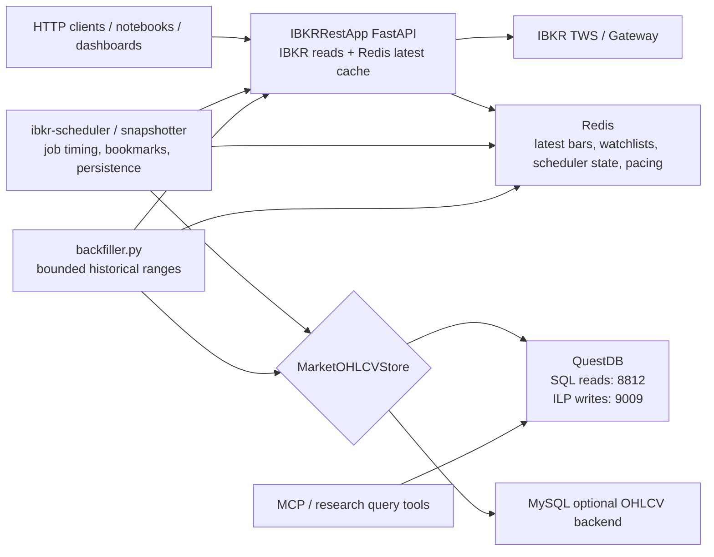

# Market Feed + Transport Layer

Production-oriented async market data foundation for systematic trading, research, and portfolio analytics.

## Design Assumptions

- Python target: 3.13+.
- Timestamp standard: all normalized OHLCV bars use UTC-aware timestamps.
- Bar semantics: timestamps represent the provider bar timestamp returned by IBKR, normalized to UTC.
- External systems: IBKR TWS or IB Gateway runs locally; Redis, QuestDB, and optional MySQL can run through Docker Compose.
- Reliability posture: live connections retry with exponential backoff, scheduled jobs isolate failures, and tests mock external systems.
- Research caution: index composition snapshots are provider-dependent and can introduce survivorship bias if reused as historical truth without point-in-time history.

## Architecture

```text
src/
  config/
    config_constant.py      # Central defaults, env names, Redis key templates, table names
    config_loader.py        # .env/environment/default loader that ignores blank values
    settings.py             # Pydantic validation over ConfigLoader output
  feeds/
    models.py               # BaseOHLCVBar, OHLCVBar, FutureOHLCVBar, FXOHLCVBar, OptionOHLCVBar, OHLCVRequest, AssetClass
    data_quality.py         # OHLCV data-quality reports and fatal/warning checks before persistence
    contracts.py            # Vendor-neutral contract specs -> IBKR mapping
    account.py              # Account, portfolio, live position, and PnL DTOs
    bonds.py                # Bond yield, CTD, and yield curve DTOs
    fundamental_data.py     # IBKR fundamental, WSH event, and forecast/event data contracts
    ibkr_feed.py            # Async IBKR historical feed client
    news.py                 # IBKR news provider/headline/article/bulletin contracts
    options.py              # Option analytics DTOs and IBKR option contract mapping
    ohlcv_loader.py         # Feed -> normalize -> persist/cache orchestration
    index_composition.py    # Provider abstraction and Redis-backed sync service
  transport/
    redis_client.py         # Latest bar, index composition, scheduler job storage
    ibkr_rate_limit.py      # Redis-backed distributed IBKR pacing bookmarks
    market_data_store.py    # Base OHLCV persistence interface
    questdb_client.py       # QuestDB PostgreSQL query client plus ILP/TCP writer
    mysql_client.py         # MySQL OHLCV store implementation
    scheduler.py            # Generic async scheduler, Redis leases/run ledger, snapshot job handlers
    scheduler_calendar.py   # Cron parsing and next-run calculation helpers
  webapp/
    app.py                  # IBKRRestApp FastAPI application factory
    dependencies.py         # API-owned IBKR, Redis, loader, and cache state
    cache.py                # Async TTL cache with per-key single-flight protection
    routers/
      account.py            # Account summary, live positions, portfolio, PnL snapshots
      market_data.py        # OHLCV, latest Redis bar, options analytics, bond yields
      reference_data.py     # Option chains, fundamentals, WSH events, news
      system.py             # Health and cache operations
schedulejob/
  reload_g10_index_composition.json
Dockerfile                # Backward-compatible API image default
Dockerfile.api            # FastAPI service image
Dockerfile.scheduler      # Scheduler worker service image
docker-compose.yml
tests/
notebooks/
```

## Runtime Ownership Graph



FastAPI does not open QuestDB or MySQL connections. It serves live/requested IBKR data and Redis-backed latest-cache operations. Durable OHLCV persistence is owned by scheduler/snapshotter workers and `backfiller.py` through `MarketOHLCVStore`; historical QuestDB reads stay outside the REST API process.

## Quick Start

1. Create the virtual environment:

```bash
make install-dev
```

If `python3.13` is not on your `PATH`, override it:

```bash
make install-dev PYTHON=/path/to/python3.13
```

2. Create your local environment file:

```bash
cp .env.example .env
```

3. Start Redis, QuestDB, and MySQL:

```bash
make services-up
```

QuestDB UI: http://localhost:9000. QuestDB is the default OHLCV store; MySQL is available for `MARKET_DATA_DB_BACKEND=mysql`.

4. Start IBKR TWS or IB Gateway locally.

Current local defaults:

- `IBKR_HOST=127.0.0.1`
- `IBKR_PORT=4001`
- `IBKR_CLIENT_ID=1`

Confirm your TWS or Gateway API settings before running live jobs. TWS paper/live and IB Gateway paper/live can use different default ports. Also keep `IBKR_CLIENT_ID` unique across notebooks, the REST API, and any other API client.

5. Run tests:

```bash
make test
```

6. Start the REST API locally:

```bash
make run-api
```

FastAPI docs: http://localhost:8000/docs

Health check:

```bash
curl http://localhost:8000/api/v1/system/health
```

7. Open notebooks:

```bash
make notebook
```

## Docker Setup

The API and scheduler are deployed as separate app containers:

- `ibkr-rest-app`: FastAPI bridge on port `8000`.
- `ibkr-scheduler`: Redis-defined scheduler worker with no public port.

Build and run both app containers with Redis, QuestDB, and MySQL:

```bash
cp .env.example .env
docker compose up -d --build ibkr-rest-app ibkr-scheduler
```

Compose exposes:

- FastAPI: http://localhost:8000/docs
- QuestDB UI: http://localhost:9000
- Redis: `localhost:6379`
- MySQL: `localhost:3306`

Inside Docker, app services set `IBKR_HOST` from `IBKR_DOCKER_HOST`, defaulting to `host.docker.internal`, so containers can reach TWS or IB Gateway running on the host machine. If you run IB Gateway in another container or remote host, override `IBKR_DOCKER_HOST` and `IBKR_DOCKER_PORT` in `.env`.

The scheduler uses `IBKR_DOCKER_REST_BASE_URL` inside Compose, defaulting to `http://ibkr-rest-app:8000`, so OHLCV snapshot jobs call FastAPI over the Docker network instead of container-local `localhost`.

The two app services intentionally use different IBKR client IDs:

- `IBKR_API_CLIENT_ID=101`
- `IBKR_SCHEDULER_CLIENT_ID=201`

Keep these distinct from notebooks and other IBKR API clients.

Docker operational defaults:

- FastAPI intentionally runs as one uvicorn worker because each worker would create a separate IBKR session, in-process cache, and streaming state.
- `ibkr-rest-app` has a healthcheck against `/api/v1/system/health`; `ibkr-scheduler` waits for that healthcheck before starting.
- App containers use `init: true`, a 30-second `stop_grace_period`, and non-root `appuser` images so SIGTERM can drain lifespan shutdown and disconnect IBKR cleanly.
- Redis and MySQL use Compose healthchecks; QuestDB remains `service_started` because the upstream image does not guarantee a portable shell/curl healthcheck tool.

Useful commands:

```bash
make docker-build
make docker-up
make docker-up-api
make docker-up-scheduler
make docker-logs-api
make docker-logs-scheduler
docker compose down
```

## Configuration

All central defaults live in `src/config/config_constant.py`. Runtime settings are loaded by `src/config/settings.py` from `.env` and environment variables.

`src/config/config_loader.py` owns the load order:

```text
config_constant defaults -> .env values -> process environment -> explicit overrides
```

Blank or missing `.env` values are treated as null and skipped, so the corresponding `config_constant.py` default remains active. Use `load_settings()` in apps, notebooks, jobs, and scripts instead of calling `python-dotenv` directly.

| Variable | Default | Purpose |
|---|---:|---|
| `IBKR_HOST` | `127.0.0.1` | TWS or IB Gateway host |
| `IBKR_PORT` | `4001` | IBKR API port |
| `IBKR_CLIENT_ID` | `1` | IBKR client ID; must be unique across API clients |
| `IBKR_MARKET_DATA_LINES` | `100` | Entitlement baseline used for pacing analysis |
| `IBKR_REST_APP_NAME` | `IBKRRestApp` | FastAPI application title |
| `IBKR_REST_CONNECT_ON_STARTUP` | `false` | Connect to IBKR and Redis during API startup instead of first request |
| `IBKR_REST_MARKET_DATA_TTL_SECONDS` | `5` | Default in-process TTL for REST market data snapshots |
| `IBKR_REST_MARKET_DATA_CACHE_MAXSIZE` | `512` | Maximum in-process REST market data cache entries |
| `IBKR_REST_OHLCV_RATE_LIMIT_RETRY_DELAY_SECONDS` | `60` | Scheduler/snapshotter wait before retrying a FastAPI OHLCV request that returns HTTP 429 |
| `IBKR_REST_OHLCV_RATE_LIMIT_RETRY_COUNT` | `1` | Number of HTTP 429 retries per scheduler/snapshotter OHLCV API call |
| `REDIS_URL` | `redis://localhost:6379/0` | Redis connection URL |
| `REDIS_PASSWORD` | empty | Optional Redis AUTH password; blank keeps unauthenticated local Redis |
| `QUESTDB_HOST` | `127.0.0.1` | QuestDB PostgreSQL wire host |
| `QUESTDB_PORT` | `8812` | QuestDB PostgreSQL wire port |
| `QUESTDB_WRITE_PORT` | `9009` | QuestDB ILP/TCP write port used by the scheduler/snapshotter |
| `QUESTDB_USER` | `admin` | QuestDB user |
| `QUESTDB_PASSWORD` | `quest` | QuestDB password |
| `QUESTDB_DATABASE` | `qdb` | QuestDB database |
| `MYSQL_HOST` | `127.0.0.1` | MySQL host for alternate OHLCV persistence |
| `MYSQL_PORT` | `3306` | MySQL port |
| `MYSQL_USER` | `root` | MySQL user |
| `MYSQL_PASSWORD` | empty | MySQL password |
| `MYSQL_DATABASE` | `trading` | MySQL database |
| `MARKET_DATA_DB_BACKEND` | `questdb` | OHLCV persistence backend: `questdb` or `mysql` |
| `INDEX_SYNC_INTERVAL_SECONDS` | `86400` | Default index composition sync interval |
| `INDEX_COMPOSITION_PROVIDER` | empty | Enables an external index composition provider when implemented |
| `FIXED_INCOME_REFERENCE_PROVIDER` | empty | Optional import path for the provider used by CTD and futures-implied curve business APIs |

## IBKRRestApp FastAPI Bridge

`IBKRRestApp` is a thin async HTTP bridge over the domain DTOs in `src/feeds`. It does not duplicate trading logic; it validates request bodies with the same Pydantic models used by notebooks, schedulers, and batch workers. It intentionally does not own QuestDB/MySQL connections; durable market-data storage is a scheduler/snapshotter responsibility.

Run locally:

```bash
uvicorn src.webapp.app:get_app --host 0.0.0.0 --port 8000 --factory --loop asyncio --lifespan on
```

The API runner intentionally uses `--loop asyncio`. `uvicorn[standard]` may otherwise select `uvloop`, and `ib_insync`/`nest_asyncio` can fail before reaching the IBKR socket under uvloop. `make run-api` does not use hot reload, which is safer for IBKR client sessions. Use `make run-api-dev` for local reload workflows. If notebooks connect but the API reports IBKR unavailable, first confirm the API is running with the standard asyncio loop and a unique `IBKR_CLIENT_ID`.

Router split:

- `GET /api/v1/business/getBondCurve`
- `GET /api/v1/business/getNewsProviders`
- `POST /api/v1/business/getSymbolNews`
- `POST /api/v1/business/getNewsArticle`
- `POST /api/v1/business/getMarketPanel`
- `POST /api/v1/business/getUniverseBars`
- `POST /api/v1/business/getReturns`
- `POST /api/v1/business/getOptionSkew`
- `POST /api/v1/business/fixed-income/getBondFutureQuotes`
- `POST /api/v1/business/fixed-income/getCTD`
- `POST /api/v1/business/fixed-income/getFuturesImpliedCurve`
- `POST /api/v1/business/fixed-income/getCashBondCurve`
- `POST /api/v1/business/fixed-income/getCurveComparison`
- `GET /api/v1/system/health`
- `GET /api/v1/system/readiness`
- `GET /api/v1/system/cache/market-data`
- `DELETE /api/v1/system/cache/market-data`
- `POST /api/v1/market-data/ohlcv`
- `POST /api/v1/market-data/ohlcv/equity`
- `POST /api/v1/market-data/ohlcv/futures`
- `POST /api/v1/market-data/ohlcv/fx`
- `POST /api/v1/market-data/ohlcv/bond`
- `GET /api/v1/market-data/latest-bar`
- `POST /api/v1/market-data/options/analytics`
- `POST /api/v1/market-data/options/skew`
- `POST /api/v1/market-data/bonds/yields/history`
- `POST /api/v1/reference-data/options/chains`
- `POST /api/v1/reference-data/fundamentals`
- `GET /api/v1/reference-data/wsh/metadata`
- `POST /api/v1/reference-data/wsh/events`
- `GET /api/v1/reference-data/news/providers`
- `POST /api/v1/reference-data/news/historical`
- `POST /api/v1/reference-data/news/article`
- `GET /api/v1/account/summary`
- `GET /api/v1/account/positions`
- `GET /api/v1/account/portfolio`
- `POST /api/v1/account/pnl/account`
- `POST /api/v1/account/pnl/position`

The app uses async FastAPI endpoints end-to-end. Market-data and business endpoints can use the in-process `AsyncTTLCache`; it has per-key single-flight protection so concurrent duplicate requests share one IBKR call. The TTL cache is intentionally short-lived and local to the API process. Redis remains the distributed cache for latest bars, index compositions, and scheduler/rate-limit bookmarks.

Business endpoint:

```bash
curl "http://localhost:8000/api/v1/business/getBondCurve?market=UST&valuation_date=2026-05-16"
```

`getBondCurve` accepts a minimal query payload:

| Parameter | Required | Notes |
|---|---:|---|
| `market` | yes | Sovereign curve alias. Supported examples: `UST`, `JGB`, `KTB`, `BUND`, `GERMAN_BUND`, `UK`, `UK_GILT`, and `GILT`. |
| `valuation_date` | no | Curve valuation date. Defaults to the current UTC date. |
| `coupon_frequency` | no | Optional coupon frequency override for par-yield bootstrap. |

The response is a business DTO with `standard_ctd_points`, a bootstrapped `curve`, and chart-ready `render_points`. Each render point includes tenor, maturity date, par yield, continuous zero rate, discount factor, CTD symbol, and futures symbol.

Business news wrapper:

```bash
curl -X POST http://localhost:8000/api/v1/business/getSymbolNews \
  -H "Content-Type: application/json" \
  -d '{"symbol":"TSLA","primary_exchange":"NASDAQ","total_results":20}'
```

`getSymbolNews` accepts a symbol instead of an IBKR `conId`, resolves/qualifies the contract, defaults to entitled news providers, and optionally fetches article bodies when `include_articles=true`. The raw IBKR-shaped news endpoints remain under `/reference-data/news/*`.

Business-route Swagger examples are sourced from `src/webapp/docs/business_api_examples.md`, so the router code stays focused on request validation and orchestration.

Research wrappers:

- `POST /api/v1/business/getMarketPanel`: multi-symbol OHLCV in normalized long form.
- `POST /api/v1/business/getUniverseBars`: load bars for explicit symbols or a Redis index composition.
- `POST /api/v1/business/getReturns`: close-to-close simple/log returns, cumulative return, and realized volatility.
- `POST /api/v1/business/getOptionSkew`: minimal symbol-level wrapper over bounded option skew.

Fixed-income business wrappers:

- `POST /api/v1/business/fixed-income/getBondFutureQuotes`: load latest IBKR OHLCV futures bars for the default sovereign curve futures or an explicit futures list.
- `POST /api/v1/business/fixed-income/getCTD`: combine an IBKR futures quote with an injected deliverable-basket provider and calculate lowest-net-basis CTD analytics.
- `POST /api/v1/business/fixed-income/getFuturesImpliedCurve`: build a CTD selected futures-implied yield curve.
- `POST /api/v1/business/fixed-income/getCashBondCurve`: build the existing indicative cash-bond curve through a POST business payload.
- `POST /api/v1/business/fixed-income/getCurveComparison`: return cash curve, futures-implied curve, and aligned zero-rate spreads.

For IBKR futures qualification, the default bond future payload generates `OHLCVRequest(asset_class="future")` with `symbol`, `exchange`, `currency`, and one of `contract_month`, `local_symbol`, or `con_id`. The CTD and futures-implied APIs intentionally require `FIXED_INCOME_REFERENCE_PROVIDER`; the provider object must expose `name` and async `get_deliverable_basket(request)`. This keeps the production boundary honest: IBKR supplies tradeable futures prices, while point-in-time deliverable baskets, conversion factors, accrued interest, and delivery-date/funding assumptions come from a controlled reference source.

Example OHLCV request:

```bash
curl -X POST http://localhost:8000/api/v1/market-data/ohlcv \
  -H "Content-Type: application/json" \
  -d '{
    "request": {
      "symbol": "SPY",
      "asset_class": "equity",
      "exchange": "SMART",
      "currency": "USD",
      "duration": "1 D",
      "bar_size": "1 min",
      "what_to_show": "TRADES",
      "use_rth": true
    },
    "persist": false,
    "cache_latest": true,
    "use_ttl_cache": true
  }'
```

The generic endpoint accepts a full `OHLCVRequest`. The asset-specific wrappers are the business-friendly OHLCV surface for minimal payloads that preset `asset_class` and common IBKR routing defaults:

| Endpoint | Minimal payload | Presets |
|---|---|---|
| `POST /api/v1/market-data/ohlcv/equity` | `{"symbol":"SPY"}` | `asset_class=equity`, `exchange=SMART`, `currency=USD`, `what_to_show=TRADES` |
| `POST /api/v1/market-data/ohlcv/fx` | `{"symbol":"EURUSD"}` | `asset_class=fx`, `exchange=IDEALPRO`, `currency=USD`, `what_to_show=MIDPOINT`, `use_rth=false` |
| `POST /api/v1/market-data/ohlcv/futures` | `{"symbol":"ES","last_trade_date_or_contract_month":"202606"}` | `asset_class=future`, `exchange=CME`, `currency=USD`, `what_to_show=TRADES` |
| `POST /api/v1/market-data/ohlcv/bond` | `{"sec_id_type":"CUSIP","sec_id":"91282CJN2"}` | `asset_class=bond`, `exchange=SMART`, `currency=USD`, `what_to_show=TRADES` |

Wrappers also accept optional loader/cache controls: `duration`, `bar_size`, `start_datetime`, `end_datetime`, `what_to_show`, `use_rth`, `persist`, `cache_latest`, `use_ttl_cache`, `cache_ttl_seconds`, and `metadata`.

Explicit range payload:

```json
{
  "symbol": "SPY",
  "start_datetime": "2026-05-01T13:30:00Z",
  "end_datetime": "2026-05-01T20:00:00Z",
  "bar_size": "1 min"
}
```

If `start_datetime` is present, the API uses the paginated historical range loader and asks IBKR in pacing-aware chunks. If only `end_datetime` and `duration` are supplied, it performs the normal single historical request ending at `end_datetime`.

OHLCV DTO hierarchy:

- `BaseOHLCVBar`: shared `symbol`, `timestamp`, `open`, `high`, `low`, `close`, and `volume`.
- `OHLCVBar`: base bar plus market metadata such as `asset_class`, `exchange`, `currency`, `bar_size`, `source`, and `metadata`.
- `FutureOHLCVBar`: futures-specific bar that adds `contract_month` and `is_continuous`. The futures wrapper documents this schema in OpenAPI.
- `FXOHLCVBar`: FX-specific bar that adds `base_currency` and `quote_currency`. The FX wrapper documents this schema in OpenAPI.
- `OptionOHLCVBar`: option-specific bar that adds `underlying_symbol`, `expiry`, `strike`, `right`, `multiplier`, `trading_class`, `contract_month`, and optional `con_id`.

Latest-bar query parameters:

| Parameter | Required | Notes |
|---|---:|---|
| `asset_class` | yes | Must be one of the `AssetClass` enum values, for example `equity`, `fx`, `future`, `bond`, `index`, `crypto`, or `option`. |
| `bar_size` | yes | Must match the OHLCV load `bar_size`, for example `1 min`; URL-encode spaces as `%20`. |
| `symbol` | no | Use this for symbol-scoped cache reads. If omitted, the endpoint reads the legacy asset-class latest key. |

Example:

```bash
curl "http://localhost:8000/api/v1/market-data/latest-bar?asset_class=equity&bar_size=1%20min&symbol=SPY"
```

This endpoint reads Redis only. It does not call IBKR or QuestDB. A missing cache entry returns JSON `null` with HTTP 200.

## Redis Keys

Latest OHLCV bar:

```text
MarketData::<asset_class>::<SYMBOL>::<bar_size>:latest
MarketData::<asset_class>::<bar_size>:latest
```

Example:

```text
MarketData::equity::SPY::1_min:latest
MarketData::equity::1_min:latest
```

The symbol-scoped key is the primary production key. The asset-class-only key is retained as a legacy pointer to the most recently cached bar for that asset-class/bar-size bucket.

Index composition:

```text
GlobalIndex:<INDEX_SYMBOL>:composition
```

Examples:

```text
GlobalIndex:SPX:composition
GlobalIndex:NDX:composition
```

Scheduler job:

```text
SchedulerJob::<job_name>
```

## Redis-Defined Market Snapshot Jobs

Scheduler jobs are JSON payloads stored in Redis. Python code registers handlers for known `job_type` values; Redis stores job configuration, not executable code.

The worker loads local `schedulejob/*.json` files first and Redis `SchedulerJob::*` keys second. Redis wins on duplicate job names, so local files are deployable defaults and Redis is the live operational override. Unknown job types or index reload jobs without a configured provider are logged and skipped, so one inactive operational job does not prevent unrelated market snapshot jobs from running. Runtime dependencies are opened only when needed: IBKR/API access for market/OHLCV snapshots, the configured market OHLCV store only when at least one runnable snapshot persists bars, and Redis for all scheduler state.

The scheduler periodically reconciles local and Redis job sources while running. It starts new jobs, removes disabled jobs, and restarts changed jobs by stable payload hash. Every run tries to acquire a Redis lease before execution, which prevents duplicate capture when more than one worker process is active.

Operational job fields:

- `timeout_seconds`: optional wall-clock timeout for one handler attempt; include enough time for API timeout plus configured OHLCV rate-limit retry sleeps.
- `max_attempts`: retry attempts for failed or timed-out runs.
- `retry_backoff_seconds`: linear backoff multiplier between attempts.
- `jitter_seconds`: optional random start delay to avoid thundering-herd starts.
- `lease_ttl_seconds`: Redis lease expiry; keep it longer than normal job runtime.
- `misfire_policy`: reserved policy field; current supported values are `run_next` and `skip`.

Example job:

```json
{
  "name": "snapshot_spy_1m",
  "job_type": "market_snapshot",
  "interval_seconds": 60,
  "enabled": true,
  "run_immediately": true,
  "params": {
    "symbol": "SPY",
    "asset_class": "equity",
    "exchange": "SMART",
    "currency": "USD",
    "duration": "1 D",
    "bar_size": "1 min",
    "what_to_show": "TRADES",
    "use_rth": true,
    "persist": true,
    "cache_latest": true
  }
}
```

Add it with `redis-cli`:

```bash
redis-cli SET SchedulerJob::snapshot_spy_1m '{
  "name":"snapshot_spy_1m",
  "job_type":"market_snapshot",
  "interval_seconds":60,
  "enabled":true,
  "run_immediately":true,
  "params":{
    "symbol":"SPY",
    "asset_class":"equity",
    "exchange":"SMART",
    "currency":"USD",
    "duration":"1 D",
    "bar_size":"1 min",
    "what_to_show":"TRADES",
    "use_rth":true,
    "persist":true,
    "cache_latest":true
  }
}'
```

Then run:

```bash
make run
```

Validate scheduler configuration before live operation:

```bash
make validate-scheduler
python scripts/validate_scheduler_jobs.py --schedule-dir schedulejob --include-redis
```

## OHLCV Persistence Backends

OHLCV snapshots are requested by the scheduler through the FastAPI OHLCV endpoint configured with `IBKR_REST_BASE_URL`. The API process owns live IBKR access and response normalization only. The scheduler/snapshotter owns latest-bar cache updates, persistence through `MarketOHLCVStore`, job timing, symbol expansion, bookmarks, and status state. `MarketOHLCVStore` is implemented by both `QuestDBClient` and `MySQLClient`.

Backend selection:

```bash
MARKET_DATA_DB_BACKEND=questdb  # default, main time-series store
MARKET_DATA_DB_BACKEND=mysql    # alternate relational store
```

Both backends expose the same operational surface:

- `create_market_ohlcv_table()`
- `insert_bars(bars)`
- `query_historical_bars(...)`
- `query_latest_bars(...)`

QuestDB should remain the default for high-volume time-series capture because `EquityOHLCV` is timestamped and day-partitioned. The scheduler uses QuestDB PostgreSQL wire on `QUESTDB_PORT=8812` for SQL/DDL and ILP/TCP on `QUESTDB_WRITE_PORT=9009` for OHLCV writes. MySQL is useful when operators want bars beside relational portfolio, strategy, or reporting tables and keeps the `market_ohlcv` table name. Both stores persist a deterministic `contract_key` plus nullable IBKR contract identity fields (`con_id`, `local_symbol`, `contract_month`, `expiry`, `strike`, `right`, `trading_class`, `what_to_show`, and `use_rth`). MySQL keys bars by `(contract_key, bar_size, timestamp)` with `ON DUPLICATE KEY UPDATE`, so same-root futures or options at the same timestamp stay distinct and repeated snapshots remain idempotent.

## OHLCV Snapshot Jobs

`job_type="ohlcv_snapshot"` is the production scheduler path for multi-market OHLCV capture. For each runnable symbol, it posts to `POST /api/v1/market-data/ohlcv` on `IBKR_REST_BASE_URL` with `persist=false`, `cache_latest=false`, and `use_ttl_cache=false`, then persists and caches the returned bars inside the scheduler/snapshotter before updating Redis bookmarks. If the API returns HTTP 429 for an IBKR pacing/rate-limit response, the snapshotter waits `IBKR_REST_OHLCV_RATE_LIMIT_RETRY_DELAY_SECONDS` and retries up to `IBKR_REST_OHLCV_RATE_LIMIT_RETRY_COUNT` times before failing the symbol. If latest Redis cache writes fail after durable persistence, the symbol stays successful with a `cache_warning`; bookmarks update only after durable persistence has succeeded. Bookmarks remain inclusive, so OHLCV persistence must stay idempotent by contract identity, bar size, and timestamp. It supports either interval scheduling or five-field cron expressions. Cron fields support `*`, ranges, lists, steps, and weekday names such as `mon-fri`.

For bounded historical ranges, run `backfiller.py` instead of creating high-frequency one-off scheduler jobs. It uses the same ownership boundary as the scheduler: API calls are made with persistence/cache disabled, then the backfiller writes returned bars through `MarketOHLCVStore` and optionally caches the latest bar in Redis.

Example symbol-control JSON:

```json
{
  "defaults": {
    "asset_class": "future",
    "exchange": "HKFE",
    "currency": "HKD",
    "bar_size": "1 min",
    "what_to_show": "TRADES",
    "use_rth": true
  },
  "symbols": [
    {"symbol": "HSI", "last_trade_date_or_contract_month": "202606"},
    {"symbol": "HTI", "last_trade_date_or_contract_month": "202606"}
  ]
}
```

Example run:

```bash
python backfiller.py \
  --start 2026-05-01 \
  --end 2026-05-28 \
  --timezone Asia/Hong_Kong \
  --symbols-file backfill_symbols.json \
  --max-concurrency 1
```

If both `cron` and `interval_seconds` are present, cron controls trigger timing. `interval_seconds` remains operational metadata and must match `params.snap_interval_seconds` for OHLCV jobs.

Local job definitions included:

- `schedulejob/ohlcv_us_equity_1m.json`
- `schedulejob/ohlcv_hk_futures_1m.json`
- `schedulejob/ohlcv_major_indices_5m.json`

Core JSON fields:

- `interval_seconds`: scheduler cadence; optional when `cron` is supplied.
- `cron`: optional five-field cron expression, for example `*/5 * * * *`.
- `timezone`: scheduler cron timezone; OHLCV params also include a market-window timezone.
- `params.start_time` / `params.end_time`: local daily capture window.
- `params.snap_interval_seconds`: business cadence; if `interval_seconds` is present it must match.
- `params.detect_holiday`: when true, fetch/cache IBKR trading schedule and skip symbols with no session.
- `params.capture_rth`: maps to `OHLCVRequest.use_rth`.
- `params.defaults`: shared OHLCV request fields plus `persist` and `cache_latest`.
- `params.symbols`: symbol objects merged over defaults.

Execution state logging uses `src.transport.scheduler.execution` and emits state markers including `running`, `cron_wait`, `lease_skipped`, `skipped_window`, `skipped_holiday`, `success`, `partial_success`, `failed`, `timeout`, `cancelled`, and `bookmark_updated`.

Redis state keys:

```text
SchedulerLease::<JOB_NAME>
SchedulerRun::<JOB_NAME>:latest
SchedulerRun::<JOB_NAME>:history
OhlcvSnapshot::<JOB_NAME>::<SYMBOL>::<BAR_SIZE>:last_ts
OhlcvSnapshot::<JOB_NAME>::<SYMBOL>::<BAR_SIZE>:status
OhlcvSnapshotCalendar::<ASSET_CLASS>::<EXCHANGE>::<SYMBOL>::<CONTRACT_FINGERPRINT>::<YYYY-MM-DD>::<true|false>:has_session
```

The handler updates `last_ts` only after successful load/persist/cache for that symbol. On restart, an existing bookmark is used as `OHLCVRequest.start_datetime` when the job request does not already specify one. Symbol-level failures roll up to job-level `partial_success` or `failed`, and telemetry/status write failures are logged without masking the original market-data result. Successful runs include the loader's data-quality summary in per-symbol Redis status and aggregate scheduler metrics; fatal data-quality invariants fail before persistence/cache.

## Schedule Job Definitions

The root-level `schedulejob/` folder stores Redis scheduler job payloads. These files are operational configuration, not importable Python modules.

Load the G10 index composition reload job into Redis:

```bash
redis-cli SET SchedulerJob::reload_g10_index_composition "$(cat schedulejob/reload_g10_index_composition.json)"
```

The job JSON shape is:

```json
{
  "name": "reload_g10_index_composition",
  "job_type": "index_composition_reload",
  "interval_seconds": 86400,
  "enabled": true,
  "run_immediately": true,
  "params": {
    "index_symbols": ["SPX", "TSX", "FTSE100", "DAX", "CAC40", "FTSEMIB", "NIKKEI225", "AEX", "BEL20", "OMXS30", "SMI"],
    "provider": "configured_provider"
  }
}
```

Field meanings:

- `name`: stable scheduler job name and Redis key suffix.
- `job_type`: selects the Python handler; `index_composition_reload` calls `IndexCompositionService.sync_many(...)`.
- `interval_seconds`: repeat interval; the bundled file uses the default `INDEX_SYNC_INTERVAL_SECONDS` value of `86400`.
- `enabled`: disabled jobs are ignored when loading from Redis.
- `run_immediately`: run once on scheduler startup before waiting for the first interval.
- `params.index_symbols`: default G10 headline equity index universe from `src/config/config_constant.py`.
- `params.provider`: placeholder marker; replace this when a production constituent provider is implemented and configured.

IBKR does not provide a direct index composition endpoint. The documented IBKR methods can resolve index contracts/security definitions and request market or historical data, but not constituents or index weights. The reload job is therefore provider-neutral and intentionally fails loudly unless a dedicated constituent provider is registered. Use point-in-time constituent data for research; current reloads are not historical membership truth.

The scheduler worker registers `index_composition_reload` only when `INDEX_COMPOSITION_PROVIDER` is a real dynamic provider import path, for example:

```bash
INDEX_COMPOSITION_PROVIDER=my_package.providers:build_provider
```

The target may be a provider instance, provider class, or zero-argument factory returning an object with `name` and async `fetch(index_symbol)`. Blank and placeholder values skip index reload jobs at Redis load time, with warnings, instead of creating a repeated failure loop.

## IBKR Index And Option Chain Capabilities

IBKR can qualify index contracts with `secType="IND"` and can load market/historical data for subscribed index instruments. IBKR also exposes option-chain metadata through `reqSecDefOptParams`, which is the preferred method for discovering stock and index option expirations, strikes, trading classes, multipliers, and exchanges after resolving the underlying `conId`.

This project implements `IBKRFeedClient.load_option_chains(...)` for equity and index underlyings. It uses `qualifyContractsAsync` first, falls back to a narrow underlying `reqContractDetailsAsync` lookup when qualification is empty, and then calls `reqSecDefOptParams`. It deliberately does not use broad option `reqContractDetails` sweeps for chains because IBKR documents `reqSecDefOptParams` as the option-chain endpoint and notes that broad option-chain contract-detail requests can be throttled and slow.

For SMART-routed US equities, pass the primary listing exchange to remove ambiguity. Example TSLA payload:

```json
{
  "request": {
    "symbol": "TSLA",
    "asset_class": "equity",
    "exchange": "SMART",
    "currency": "USD",
    "primary_exchange": "NASDAQ"
  },
  "use_ttl_cache": true,
  "cache_ttl_seconds": 300
}
```

If the app already knows the IBKR underlying `conId`, `underlying_con_id` can be supplied to skip the underlying qualification call entirely.

## IBKR Options Analytics

Options analytics are represented in `src/feeds/options.py`:

- `OptionContractSpec`: one specific option contract, including underlying, expiry, strike, right, multiplier, trading class, and optional `conId`.
- `OptionAnalyticsRequest`: short-lived market-data request using IBKR generic ticks `100`, `101`, `104`, `105`, and `106`.
- `OptionGreekSet`: bid, ask, last, or model Greek payload.
- `OptionAnalyticsSnapshot`: delta, gamma, theta, vega, implied volatility, historical volatility, open interest, and option volume.
- `OptionSkewSurfaceRequest`: bounded per-maturity skew scan seeded from the option-chain endpoint.
- `OptionMaturitySkew`: one expiry's put-minus-call IV skew plus the largest call/put open-interest strikes.

IBKR exposes option Greeks through option computation market data fields such as `bidGreeks`, `askGreeks`, `lastGreeks`, and `modelGreeks` in `ib_insync`. Option volume/open-interest style values require generic ticks. The project default asks for:

| Generic tick | Meaning |
|---:|---|
| `100` | Option volume |
| `101` | Option open interest |
| `104` | Historical volatility |
| `105` | Average option volume |
| `106` | Option implied volatility |

Do not request a full option chain as market data in one shot. Use `load_option_chains(...)` to discover expiries/strikes/trading classes, filter to the slice you need, then call `load_option_analytics(...)` only for selected contracts.

IBKR does not allow snapshot market-data requests with generic ticks. When `generic_ticks` is non-empty, this project opens a short-lived streaming market-data subscription, waits `snapshot_wait_seconds`, normalizes the latest fields into a snapshot DTO, and cancels the subscription. If `generic_ticks` is empty, the single-contract analytics endpoint can use true IBKR snapshot mode.

The skew endpoint follows that same discipline. It samples a bounded strike window around spot, requests call/put short-lived market-data subscriptions for those strikes, selects the nearest target-delta call and put for each expiry, and reports `skew_put_minus_call_iv = put IV - call IV`. If Greeks are missing, it falls back to a symmetric moneyness selection. Each strike/right pair consumes a temporary market-data line, so increase `max_expirations`, `max_strikes_per_expiry`, and `max_concurrent_requests` carefully.

REST endpoints:

```text
POST /api/v1/market-data/options/analytics
POST /api/v1/market-data/options/skew
```

## IBKR Fundamental And Economic Data

IBKR has three relevant API surfaces:

- TWS `reqFundamentalData`: legacy/deprecated company fundamental reports returned as XML. Supported report types in this project are `ReportSnapshot`, `ReportsFinSummary`, `ReportRatios`, `ReportsFinStatements`, `ReportsOwnership`, `CalendarReport`, and `RESC`.
- TWS Wall Street Horizon: corporate/event calendar metadata and events returned as JSON through `getWshMetaDataAsync` and `getWshEventDataAsync` in `ib_insync`. This requires a Wall Street Horizon subscription, and metadata must be requested before event data.
- Client Portal Forecast/Event Contracts: economic-indicator-related tradable event contract metadata such as category trees. This is not a macroeconomic time-series endpoint.

This project stores these as explicit data contracts in `src/feeds/fundamental_data.py`:

- `FundamentalDataRequest` and `FundamentalDataReport`
- `WSHEventDataRequest`, `WSHMetadataReport`, and `WSHEventDataReport`
- `ForecastEventContractCategory`

Quant caveat: IBKR fundamental reports and WSH events are vendor payloads with their own licensing and revision behavior. Preserve raw XML/JSON and timestamps before deriving factors, and do not treat Forecast/Event Contract metadata as released macroeconomic observations.

## IBKR News Feed

IBKR offers API news, subject to API-specific news subscriptions and provider entitlements. The TWS API supports:

- `reqNewsProviders`: list subscribed news providers.
- Contract-specific real-time news through `reqMktData` using generic tick `292`.
- BroadTape news through `NEWS` contracts and generic tick `292`.
- `tickNews`: real-time headline callback containing timestamp, provider, article id, headline, and extra data.
- `reqHistoricalNews`: historical headline lookup by contract id and provider codes.
- `reqNewsArticle`: article body lookup by provider code and article id.
- `reqNewsBulletins`: IBKR system/news bulletins.

This project stores those wire shapes in `src/feeds/news.py`:

- `NewsProvider`
- `HistoricalNewsRequest` and `HistoricalNewsHeadline`
- `NewsArticleRequest` and `NewsArticle`
- `NewsTick`
- `NewsBulletin`

`IBKRFeedClient` has one-shot helpers for providers, historical headlines, and article body lookup. Real-time news subscriptions should be added as a separate streaming layer because they are long-lived market data subscriptions and consume the account’s market data/news entitlements.

## Bond Data, CTD, And Yield Curves

Bond and yield-curve DTOs live in `src/feeds/bonds.py`.

Supported DTOs:

- `BondInstrument`: sovereign/corporate bond identity using symbol, ISIN, CUSIP, or IBKR `conId`.
- `BondYieldQuote`: latest bid, ask, last, and computed mid yield.
- `BondYieldHistoryRequest` and `BondYieldBar`: historical yield bars for `YIELD_BID`, `YIELD_ASK`, `YIELD_BID_ASK`, and `YIELD_LAST`.
- `CTDFutureDefinition`, `CTDBondCandidate`, and `CTDBondSnapshot`: CTD delivery-basket analytics for US Treasury, JGB, KTB, German Bund, and UK Gilt futures.
- `YieldCurveBootstrapInstrument`, `YieldCurvePoint`, and `YieldCurveDTO`: par-yield curve inputs and bootstrapped discount/zero curve outputs.
- `BondCurveRequest`, `StandardTenorCTDPoint`, `BondCurveRenderPoint`, and `BondCurveResponse`: business-facing sovereign curve payloads for API consumers and dashboards.

IBKR historical bar documentation lists yield fields for bonds, but the same table notes that yield historical data is only available for corporate bonds. For US Treasury, JGB, KTB, and German Bund CTD capture, IBKR should be treated as a quote/contract source only. The actual deliverable basket, conversion factor, accrued interest, delivery date, financing/carry, and CTD selection require an exchange, vendor, or internally controlled delivery-basket provider.

`YieldCurveDTO.bootstrap()` uses a deterministic par-yield bootstrap with ACT/365F year fractions, regular coupon dates, continuous zero rates, and log-linear discount-factor interpolation. `YieldCurveDTO.bootscrape()` is included as a backward-compatible alias for the requested method name.

REST endpoint:

```text
GET  /api/v1/business/getBondCurve
POST /api/v1/business/fixed-income/getBondFutureQuotes
POST /api/v1/business/fixed-income/getCTD
POST /api/v1/business/fixed-income/getFuturesImpliedCurve
POST /api/v1/business/fixed-income/getCashBondCurve
POST /api/v1/business/fixed-income/getCurveComparison
POST /api/v1/market-data/bonds/yields/history
```

`GET /api/v1/business/getBondCurve` is intentionally minimal. A caller can request `market=UST`, `JGB`, `KTB`, `BUND`, `GERMAN_BUND`, `UK`, `UK_GILT`, or `GILT`, and optionally pass `valuation_date` and `coupon_frequency`. The API returns standard-tenor CTD/benchmark inputs plus `render_points` that are ready for a line chart or risk dashboard.

Quant caveat: the built-in `getBondCurve` source is an indicative standard-tenor placeholder so Swagger, notebooks, and downstream services can integrate against a stable DTO. It is not an exchange-official CTD engine. Before trading, backtesting, or risk reporting from this endpoint, replace the placeholder with a controlled provider for delivery baskets, conversion factors, accrued interest, delivery dates, financing/carry, futures prices, and point-in-time bond/yield quotes.

The fixed-income futures endpoints use IBKR as a futures quote source and then hand off to the configured reference provider for CTD terms. The request parameters are aligned to TWS futures contract construction: `symbol`, `exchange`, `currency`, and either `lastTradeDateOrContractMonth` via the API-facing `contract_month`, `local_symbol`, or `con_id`. Bond yield historical fields remain under `/market-data/bonds/yields/history`; IBKR documents those `whatToShow` values, but also notes historical yield availability limitations, so sovereign curve construction should not rely on yield bars alone. IBKR also documents historical/live bar restrictions for OSE, so JGB futures should be treated as feed dependent until validated against the target IB Gateway entitlements.

## IBKR Account, Position, And PnL Data

Account/risk DTOs live in `src/feeds/account.py`.

Supported DTOs:

- `AccountValueDTO`
- `AccountSummaryDTO`
- `LivePositionDTO`
- `PortfolioItemDTO`
- `AccountPnLDTO`
- `PositionPnLDTO`

`IBKRFeedClient` exposes:

- `load_account_summary(...)`
- `load_live_positions(...)`
- `load_portfolio_items(...)`
- `subscribe_account_pnl(...)`
- `subscribe_position_pnl(...)`
- `load_account_pnl_snapshot(...)`
- `load_position_pnl_snapshot(...)`

The REST API uses short-lived PnL snapshot helpers for HTTP calls, then cancels the IBKR PnL subscription. Long-lived streaming PnL should be handled by a dedicated risk-engine service, not by holding open normal REST requests.

IBKR caveats:

- Account Window PnL and Portfolio Window PnL can differ because they use different sources and reset schedules.
- `reqPnL` and `reqPnLSingle` update roughly once per second, subject to IBKR changes.
- Some PnL values can be unset max-double sentinels; the DTO normalizers convert those to `None`.
- Virtual FX PnL behavior depends on TWS Account Window configuration.

REST endpoints:

```text
GET  /api/v1/account/summary
GET  /api/v1/account/positions
GET  /api/v1/account/portfolio
POST /api/v1/account/pnl/account
POST /api/v1/account/pnl/position
```

## IBKR Pacing And Rate-Limit Standard

This section caches the IBKR rate-limit assumptions used by this project as of the documentation reviewed on 2026-05-14.

Primary sources:

- [IBKR Campus TWS API Documentation](https://www.interactivebrokers.com/campus/ibkr-api-page/twsapi-doc/)
- [IBKR Campus Web API v1.0 Documentation](https://ibkrcampus.com/campus/ibkr-api-page/cpapi-v1/)
- [IBKR Campus Market Data Subscriptions](https://ibkrcampus.com/campus/ibkr-api-page/market-data-subscriptions/)
- [Legacy TWS API Historical Data Limitations](https://interactivebrokers.github.io/tws-api/historical_limitations.html)
- [Legacy TWS API Historical Bar Data](https://interactivebrokers.github.io/tws-api/historical_bars.html)
- [Legacy TWS API Options](https://interactivebrokers.github.io/tws-api/options.html)
- [Legacy TWS API Profit And Loss](https://interactivebrokers.github.io/tws-api/pnl.html)
- [Legacy TWS API Available Tick Types](https://interactivebrokers.github.io/tws-api/tick_types.html)
- [Legacy TWS API News](https://interactivebrokers.github.io/tws-api/news.html)
- [Legacy TWS API EClient Reference](https://interactivebrokers.github.io/tws-api/classIBApi_1_1EClient.html)
- [ib_insync API Reference](https://ib-insync.readthedocs.io/api.html)

Documented standards:

| Area | IBKR Standard | Project Control |
|---|---:|---|
| General API request pacing | Maximum requests per second equals maximum market data lines divided by 2. Default 100 lines implies 50 requests/second. | `IBKRRateLimitController` enforces a global outgoing-message bucket before IBKR socket calls; default cap is 50/sec. |
| Market data lines | Default minimum is 100 concurrent real-time market data lines, shared across TWS watchlists and API clients. | The controller leases active app-owned market-data lines for `reqMktData`, snapshots, option analytics, FX option capture, tick streams, and streaming flows. |
| Historical small-bar pacing | Avoid identical historical requests inside 15 seconds. | `IBKRHistoricalPacingGuard` enforces identical request cooldown. |
| Historical same-contract burst | Avoid six or more historical requests for the same contract, exchange, and tick type within 2 seconds. | Guard allows at most five in the 2-second window. |
| Historical rolling window | Avoid more than 60 historical requests in 10 minutes. `BID_ASK` counts twice. | Guard enforces 60 weighted requests per 600 seconds. |
| Real-time bars | 5-second real-time bars combine top-of-book line limits and historical pacing; no more than 60 new requests in 600 seconds. | Not implemented yet; use the same guard before adding real-time bars. |
| Tick-by-tick and depth | Specialized limits scale with market data lines; default examples show 5 tick-by-tick and 3 depth streams at 100 lines. | Out of scope for this OHLCV foundation; must be separately budgeted. |

Will this setup hit IBKR pacing limits?

For the default snapshot design, it should not hit limits if you keep the number of Redis `market_snapshot` jobs conservative. The implementation sends one historical request per snapshot job run, then lets `IBKRRateLimitController` throttle bursts across all jobs sharing the same Redis pacing namespace.

The REST app and scheduler use `IBKRRateLimitController`, which stores historical bookmarks, the global outgoing-message window, and active market-data-line leases in Redis with atomic Lua checks. This is safer than a pure in-memory limiter because notebooks, background workers, and multiple scheduler processes share the same request budget. If Redis is unavailable, the controller falls back to local in-process limiting rather than sending an unbounded burst.

Redis pacing keys:

```text
IBKRRateLimit:historical:window
IBKRRateLimit:historical:identical:<request_hash>
IBKRRateLimit:historical:same_contract:<contract_hash>
IBKRRateLimit:global:window
IBKRRateLimit:market_data:leases
```

The limiter uses sorted sets for rolling windows and market-data-line leases, plus short-lived keys for identical-request cooldowns. Market-data leases are released after `cancelMktData` and also have a TTL safety net for process crashes. The app cannot see TWS watchlists or external API clients, so keep a reserve with `IBKR_RATE_LIMIT_MARKET_DATA_RESERVE`.

Capacity rule of thumb:

```text
safe_jobs_at_interval <= floor(60 * interval_seconds / 600)
```

Examples:

| Job interval | Approximate safe historical jobs |
|---:|---:|
| 60 seconds | 6 jobs |
| 120 seconds | 12 jobs |
| 300 seconds | 30 jobs |
| 600 seconds | 60 jobs |

Use lower limits for `BID_ASK` because IBKR counts each request twice. For example, at a 60-second interval, treat the safe budget as roughly 3 `BID_ASK` jobs.

Operational recommendations:

- Prefer `bar_size="1 min"` or larger for regular snapshot jobs.
- Stagger job intervals or use different start times when scaling beyond a handful of symbols.
- Keep TWS watchlists small during API runs, because watchlists consume market data lines too.
- For large historical backfills, use `backfiller.py` or extend it with durable progress state instead of using high-frequency scheduler jobs.
- If your strategy needs broad real-time streaming, use a proper market data vendor or explicitly budget IBKR market data lines and subscriptions before relying on TWS API.

## Market OHLCV Schema

QuestDB main table: `EquityOHLCV`

QuestDB schema: timestamped on `timestamp`, partitioned by day, stores metadata as JSON text plus nullable contract identity columns.

MySQL main table: `market_ohlcv`

MySQL schema: InnoDB table with `(contract_key, bar_size, timestamp)` primary key, secondary indexes for latest/history reads, nullable contract identity columns, and `metadata JSON`.

Both query builders are parameterized to avoid unsafe string interpolation.

## Quant Engineering Notes

- Treat IBKR historical data as vendor data, not ground truth. Corporate actions, roll methodology, adjusted versus unadjusted series, and trading calendar gaps need explicit treatment before research conclusions.
- Do not use current index constituents as if they were historical constituents. For index research, store point-in-time composition snapshots and label provider/as-of metadata.
- Keep all derived factor logic outside the feed adapter. The feed layer should deliver timestamp-safe normalized bars; research modules can decide alignment, forward-fill, and lagging policy.
- For live trading, add monitoring around gateway health, request pacing, missed bars, Redis staleness, and QuestDB insert lag before attaching execution.
